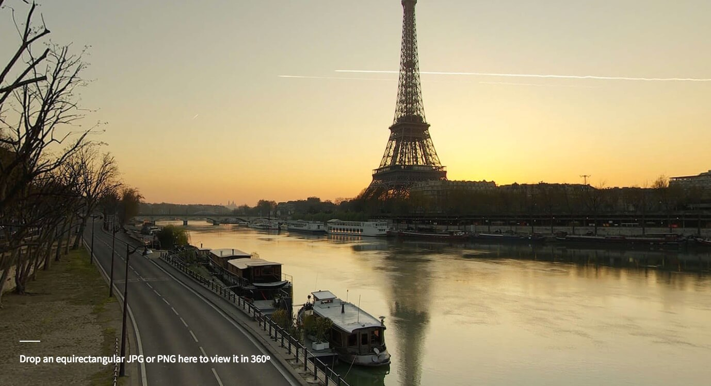

# 360-image-viewer

A standalone panorama WebGL image viewer for desktop and mobile. This uses [regl](https://www.npmjs.com/package/regl) as the WebGL wrapper, and comes in at a total of 140kb uglified, or 46kb gzipped. This is useful if you need a panorama viewer but don't want to embed all of ThreeJS (which is around 500kb uglified).

## Install

```sh
npm install 360-image-viewer --save
```

## Live Demo

Click [here](http://360-image-viewer-test.surge.sh/) to see a demo of this module in action. The source code is in [demo/index.js](./demo/index.js).

[](http://360-image-viewer-test.surge.sh/)

## Example

The code below sets up a full-screen 360 image viewer. For a more complete example, see [demo/index.js](./demo/index.js).

```js
const create360Viewer = require('360-image-viewer');
const canvasFit = require('canvas-fit');

// load your image
const image = new Image();
image.src = 'panosphere.jpg';

image.onload = () => {
  // when the image is loaded, setup the viewer
  const viewer = create360Viewer({
    image: image
  });

  // attach canvas to body
  document.body.appendChild(viewer.canvas);

  // setup fullscreen canvas sizing
  const fit = canvasFit(viewer.canvas, window, window.devicePixelRatio);
  window.addEventListener('resize', fit, false);
  fit();

  // start the render loop
  viewer.start();
};
```

## Usage

#### `viewer = create360Viewer([opt])`

Creates and returns a new WebGL canvas viewer with the specified `opt` options object.

Options:

- `image` — the HTMLImageElement, if not specified it can be set later
- `canvas` —  a `<canvas>` tag to use, otherwise creates a new one
- `fov` — a field of view, in radians, defaults to 45 degrees
- `rotateSpeed` — a scalar for the drag rotation speed, default 0.15
- `damping` — a scalar for damping/spring, default 0.275
- `clearColor` — a RGBA clear color, default `[ 0, 0, 0, 0 ]` (ie. transparent)

You can also pass [orbit-controls](https://github.com/Jam3/orbit-controls) options, for example `phi` as the initial rotation, or passing `{ rotate: fale }` to ignore mouse/touch rotation.

The `image` should be a DOM Image or Video element, and should already be loaded.

#### `viewer.start()`

Start the requestAnimationFrame render loop.

#### `viewer.stop()`

Stop the requestAnimationFrame render loop.

#### `viewer.render()`

Render a single frame. This may be useful if, say, you change the canvas size when the requestAnimationFrame is not running.

#### `viewer.enableControls()`

Enable the input controls, attaching mouse/touch events to the canvas. Has no effect if the controls are already enabled.

#### `viewer.disableControls()`

Disable the input controls, detaching mouse/touch events from the canvas. Has no effect if the controls are already disabled.

#### `viewer.texture(image)`

Changes the current image to the specified DOM `image`. This can be an image, video, or an options object for [regl#texture()](https://github.com/regl-project/regl/blob/gh-pages/API.md#textures). By default, `min` and `mag` filter will use `'linear'` for smoother filtering.

#### `viewer.destroy()`

Stop the render loop, disable the input controls, and destroy the WebGL context. The viewer will no longer be usable after this point.

#### `viewer.canvas`

The canvas the viewer will render into.

#### `viewer.fov`

The current field of view of the perspective camera in radians. Can be altered at run-time.

#### `viewer.phi`

The current horizontal rotation angle in radians.

#### `viewer.theta`

The current vertical rotation angle in radians.

#### `viewer.on('tick', fn)`

Attach a frame listener to the viewer, where `fn` accepts the `dt` (delta time) parameter per frame. You can remove this with `viewer.removeListener('tick', fn)`.

## License

MIT, see [LICENSE.md](http://github.com/Jam3/360-image-viewer/blob/master/LICENSE.md) for details.
